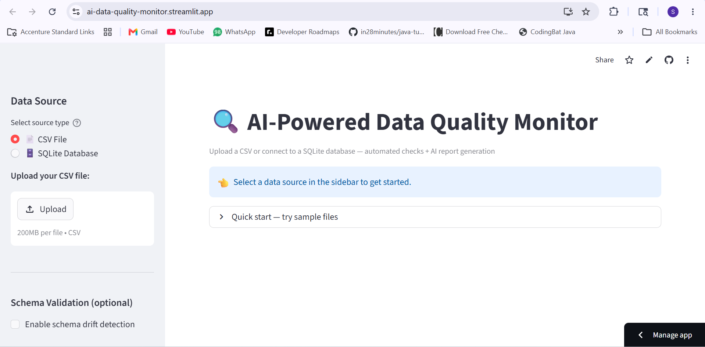

# AI-Powered Data Quality Monitor

Automated data quality pipeline that runs checks on any CSV or SQLite database and uses AzureOpenAI(GPT-4o-mini) to generate plain-English reports for business stakeholders.

## Live Demo
**[Launch App](https://ai-data-quality-monitor.streamlit.app)**

## Problem Statement
Data engineers routinely deal with dirty data — nulls, duplicates, outliers, and schema drift — that silently corrupt downstream reports. Manual inspection doesn't scale. This tool automates detection and makes results readable to non-technical stakeholders via LLM.

## Features
- Dual ingestion: CSV file upload or SQLite database connection
- 5 automated checks: null values, duplicates, outliers, schema drift, date validity
- AI-generated plain-English stakeholder report via Azure OpenAI (GPT-4o-mini)
- Interactive Streamlit dashboard with Plotly visualizations
- Downloadable results (JSON) and report (TXT)

## Tech Stack
- Python 
- Pandas 
- Streamlit 
- Plotly 
- LangChain 
- Azure OpenAI (GPT-4o-mini)

## Screenshots

### App Homepage


### Sample Results
- [CSV Mode Results (txt)](screenshots/LLM_1.txt)
- [SQLite Mode Results (txt)](screenshots/LLM_2.txt)
- [SQLite Mode Results (json)](screenshots/LLM_output_1.json)
- [CSV Mode Results (json)](screenshots/LLM_output_2.json)

### Dashboard


### Check Details


### Data Preview


## Project Structure
Data Quality Monitor/
├── app.py              ← Streamlit dashboard
├── checker.py          ← Quality check logic (5 checks)
├── llm_report.py       ← Azure OpenAI report generation
├── sample_data.csv     ← Sample dataset with intentional dirty data
├── requirements.txt
├── .streamlit/
│   └── config.toml
├── screenshots/
│   ├── first_page.pdf
│   ├── LLM_1.txt
│   ├── LLM_2.txt
│   └── LLM_output_1.json
│    └── LLM_output_2.json
│    └── second page.pdf
│    └── streamlit ss 1.png
│   └── third page.pdf
└── README.md

## How to Run

### 1. Install dependencies
```bash
pip install -r requirements.txt
```
### 2. Configure Azure OpenAI in `.env`
AZURE_OPENAI_ENDPOINT=https://your-resource.openai.azure.com/
AZURE_OPENAI_API_KEY=your-key-here
AZURE_OPENAI_MODEL=gpt-4o-mini
AZURE_OPENAI_DEPLOYMENT=gpt-4o-mini


### 3. Launch
```bash
streamlit run app.py
```

## Data Sources Supported
- **Mode 1 — CSV:** Upload any CSV file via the sidebar
- **Mode 2 — SQLite:** Enter database path + select table from dropdown

## Quality Checks Performed
| Check | What It Detects |
|---|---|
| Null Values | Missing data per column with % impact |
| Duplicates | Fully duplicated rows |
| Outliers | Statistical anomalies using IQR method |
| Schema Drift | Columns whose data type changed from expected |
| Date Validity | Unparseable date strings in date columns |

## Sample Output
Both CSV and SQLite modes produce:
- `results.json` — structured check results
- AI report — plain-English stakeholder summary via GPT-4o-mini

## Motivation
Built to demonstrate end-to-end data engineering + AI integration skills, directly extending pipeline monitoring work done professionally.
